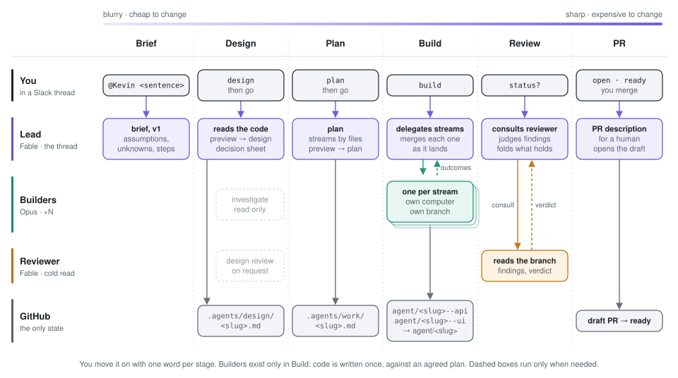

# Kevin: product development agent for Slack

Kevin works through the approach with you before writing code. Refine the
brief, design and plan in a Slack thread, then let separate agents implement
and review the change. You get a draft pull request. Small fixes can go
straight to building.

It runs as one [OpenComputer serverless agents](https://docs.opencomputer.dev/agents/overview)
project, with Slack for conversation and GitHub for documents and code.

<picture>
  <source media="(prefers-color-scheme: dark)" srcset="docs/how-it-works-dark.svg">
  
</picture>

[In a thread](#in-a-thread) · [The agents](#the-agents) · [Run your own](#run-your-own) · [Make it yours](#make-it-yours)

## In a thread

For example:

> **You:** @Kevin CSV export in acme-service breaks when a customer's name has a comma.
>
> **Kevin:** I'll check the writer and parser, then propose a fix that keeps the current CSV format.
>
> [ design ] [ build now ] [ revise ]
>
> **You:** @Kevin Handle quotes and newlines too, but keep the parser's public API unchanged.

Kevin folds the correction into the proposal. Approved designs and plans
are committed under `.agents/` on `agent/<slug>` and linked in the thread.
The plan assigns files and checks to each builder; independent assignments
run in parallel and merge into that working branch.

Builders report back as they finish. When all have landed, mention
`@Kevin review`. Kevin assesses the findings and previews the PR description.
**Open** creates the draft; **ready** marks it ready for review. You merge.

Buttons need no mention. Typed replies do: `@Kevin status?`, for example.
Each thread has one owner; start a new thread for another piece of work.

## The agents

Kevin has three [agent definitions](https://docs.opencomputer.dev/agents/projects),
declared in [`project.ts`](opencomputer/project.ts):

```ts
export default { name: "kevin", agents: ["lead", "implementer", "reviewer"] };
```

A definition specifies a model, tools and instructions. A
[session](https://docs.opencomputer.dev/agents/sessions) is a conversation
with that agent: one lead session per Slack thread, one implementer session
per assignment.

- **[Lead](opencomputer/agents/lead/agent.ts) — Fable.** Keeps the conversation,
  writes the documents and integrates branches. It owns the approach; its
  instructions leave product code to the builders.
- **[Implementer](opencomputer/agents/implementer/agent.ts) — Opus.** Gets
  one assignment and its own computer and branch. Builders read the agreed
  documents, implement and run checks without inheriting discarded ideas
  from the conversation.
- **[Reviewer](opencomputer/agents/reviewer/agent.ts) — Fable.** Reads the
  artifacts without the conversation, judging what was written rather than
  what the lead intended. Its [GitHub connection](opencomputer/agents/reviewer/connections/github.ts)
  has read permissions; its instructions prohibit local writes and running tests.

The implementer's entry point selects its tools and returns instructions
for the assignment (imports and helpers omitted):

```ts
export default function Implementer() {
  useModel("anthropic/claude-opus-5.5");
  const parsed = parseAssignment(useInput().payload);
  if (!parsed.ok) {
    return [implementerInstructions(), renderRefusal(parsed.problems)]
      .join("\n\n");
  }
  useTool("sandbox_exec");
  useConnection(github);
  return [implementerInstructions(), renderAssignment(parsed.assignment)]
    .join("\n\n");
}
```

OpenComputer runs the [model and tool loop](https://docs.opencomputer.dev/agents/hooks),
delivers Slack messages and starts computers as needed. No webhook server,
job queue or application database needs deploying alongside the agents.

Kevin's [`delegate`](opencomputer/agents/lead/tools/delegate.ts) tool starts
builder sessions and subscribes to their outcomes. A builder's report wakes
the lead to record and integrate its work. `consult` requests a review;
`ask` posts a question with Slack buttons.

Conversations live in OpenComputer. Designs, plans, code and builder session
IDs live in GitHub; [`where_are_we`](opencomputer/agents/lead/tools/where-are-we.ts)
reads that state on follow-ups. The computer's clone is a cache.
[GitHub permissions](https://docs.opencomputer.dev/agents/github) differ per
agent. A [managed HTTP connection](opencomputer/agents/lead/connections/opencomputer.ts)
attaches the lead's API key to requests without exposing it to the model.

## Run your own

You need Node.js 22, an OpenComputer account, and permission to install apps
in your Slack workspace and GitHub repositories.

1. **Create the project.**

   ```bash
   git clone https://github.com/diggerhq/opencomputer-example-kevin.git
   cd opencomputer-example-kevin
   npm ci
   npx opencomputer login
   npx opencomputer link --create-project kevin
   ```

2. **Configure Kevin.** In [`config.ts`](opencomputer/agents/lead/config.ts), replace `projectId`
   with the printed ID and set `agentPrefix` to your project's slug (`kevin`
   for the command above). Keep `environment: "development"`.

3. **Set the API key and deploy.** Create a dedicated key on the dashboard's
   **API Keys** page. Kevin uses it to start sessions and receive results.
   It has organization-wide access even when stored as a project secret.
   Save it in the gitignored `opencomputer/.env.local`:

   ```dotenv
   OPENCOMPUTER_API_KEY=<your-key>
   ```

   Upload it and deploy all three agents:

   ```bash
   npm run secret
   npm run check
   npm run deploy
   ```

4. **Connect GitHub.** Select the repositories Kevin may work on:

   ```bash
   npx opencomputer github connect
   ```

5. **Connect Slack.** In the dashboard, open **kevin → Development → Connections → lead →
   Create Slack bot**. Follow the [Slack setup](https://docs.opencomputer.dev/agents/slack)
   to create and authorize the bot using an App configuration access token.
   In your channel, `/invite @Kevin`, then mention it with a request and
   repository name. Its first response is a brief, before any code changes.

## Make it yours

- **Repository rules:** add `.agents/conventions.md` to the target repo
  ([template](templates/conventions.md)) to say which changes need a design,
  which can ship directly, and which checks to run. For example: API changes
  need a design; documentation fixes can go straight to building.
- **Method and voice:** edit [`process/`](process/). These are instructions
  and examples the model adapts to the work. `npm run generate` copies
  this source into each agent's bundle.
- **Models and tools:** edit each `agent.ts` and the lead's
  [`tools/`](opencomputer/agents/lead/tools/). `maxImplementers` defaults to seven.
- **Documents elsewhere:** set `docsRepo` in `config.ts` to write documents
  to a separate repository's default branch.

After changes, run `npm run check` and `npm run deploy`. New sessions use
the updated Development versions; existing sessions keep theirs. Start a
new Slack thread to try the updated lead.

For Production, set `environment: "production"` **before** running
`npm run secret` and `npm run deploy -- --alias production`, then connect
a separate Slack bot on the project's Production lead row.

## Running Kevin

- **Stop is cooperative:** Kevin records the request and acts on the
  builder's next report; it does not interrupt a running command.
- **Reviews can be quiet for up to ten minutes.** Messages sent meanwhile
  are held for the lead's next reply. Kevin reports when review is unavailable.
- **Usage grows with the work.** A two-builder task normally involves four
  sessions: the lead, two builders and a reviewer. Retries and investigations
  add sessions. Concurrent threads also receive and discard unrelated
  builder outcomes, adding model turns.
- **Recovery has limits:** discovery needs the working branches and plan
  to remain on GitHub. A session whose computer failed to launch may need
  replacing with a new thread.

Inspect sessions in the dashboard or CLI:

```bash
npx opencomputer session list
npx opencomputer session inspect <session-id>
npx opencomputer logs --session <session-id>
npx opencomputer sessions tail <session-id> --no-follow
```

`sessions tail` prints a session's full event log: the instructions each
turn was given, the model's reasoning, every tool call and its result. The
lead's tools add a `tool.progress` record for each command and API call
(exit code, duration, the end of any error output, credentials removed), so
a failure the lead reported in one sentence can be traced to the command
that caused it.

See [setup and authoring gotchas](DX-NOTES.md) for troubleshooting.
`npm run check` checks generated files, types, tests and project configuration
without starting agents.
